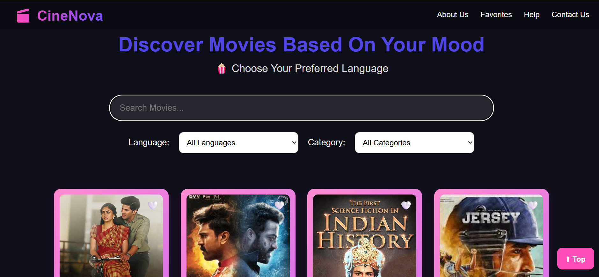
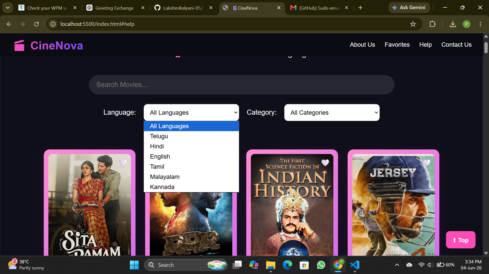
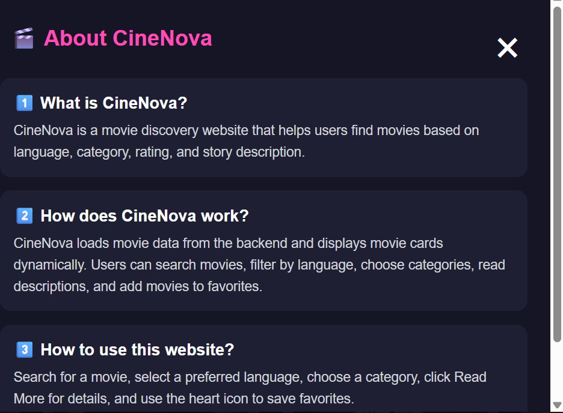

# 🎬 CineNova

## Overview

CineNova is a movie discovery web application that helps users explore movies across different languages and genres. Users can search movies, filter by language and category, read detailed descriptions, and save their favorite movies for a personalized experience.

## Features

* 🔍 Search movies by name
* 🌐 Filter movies by language
* 🎭 Filter movies by category
* ❤️ Add and view favorite movies
* 📖 Read detailed movie descriptions
* ℹ️ About Us section
* 📩 Contact and Help sections
* 📱 Responsive design for mobile and desktop

## Technologies Used

* HTML
* CSS
* JavaScript
* Python Flask
* JSON

## Screenshots

### Homepage

### Language Filter

### Favorites

### About Us

## Future Enhancements

* Movie recommendations
* User authentication
* Watchlist feature
* Ratings and reviews

## Developer

**Palagani Lakshmi Kalyani**

B.Tech – Computer Science and Engineering

Vikas College of Engineering and Technology
